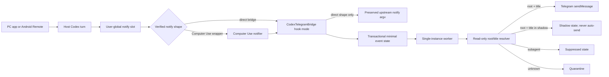

# Codex Telegram Completion Notification Blueprint

## Document control

- Status: final-plan candidate; it becomes the frozen final plan automatically when the companion review-loop notes record three consecutive full-scope `PASS` iterations
- Blueprint date: 2026-07-11
- Target platform: Windows 10/11 x64 host PCs, Android recipient
- Initial canary host: `DESKTOP-JFCCDJJ`
- Scope: design and rollout plan only; implementation is a later, separately authorized phase
- Convergence rule: any blueprint correction resets the consecutive-pass count to zero. Convergence changes only the companion notes, not this blueprint; any later blueprint edit reopens review and again requires three consecutive passes.

## 1. Objective

Build a Windows sidecar that sends one Telegram notification whenever a user-visible, top-level Codex turn ends normally on a participating PC, regardless of whether the turn was started in the desktop app or through Android Remote.

Runtime message shape is fixed:

```text
✅ Codex 응답 완료
PC: <current Windows computer name or configured alias>
스레드: <first 12 grapheme clusters of current Codex thread title, plus … when truncated>
```

No summary, prompt, response body, working directory, model, status detail, timestamp, or title text beyond that display prefix is sent.

## 2. Sealed requirements

These decisions are closed and must not be reopened during implementation unless the user explicitly changes them:

1. All v1 participating host PCs run x64 Windows 10 or Windows 11. ARM64 hosts fail preflight and require a later architecture qualification; v1 does not ship an untested ARM64 build.
2. Android is only the notification recipient and Remote control surface; no Android companion app is built.
3. Notify every normal completion of a user-visible top-level Codex turn.
4. Exclude internal subagent and guardian/reviewer completions.
5. A normal turn that reports inability, partial completion, or asks the user to clarify still generates a notification.
6. A cancelled, interrupted, or error-terminated turn does not generate a notification.
7. Runtime Telegram text contains only the fixed completion line, PC name, and the first 12 grapheme clusters of the thread title plus one ellipsis when truncated.
8. Use one Telegram bot and one private 1:1 bot chat for all PCs.
9. Validate on the current PC first. Do not deploy to another PC until the current-PC canary gate passes.
10. Existing Codex/Computer Use notification behavior must be preserved.
11. No internal subagent notification toggle is exposed in v1; subagents are always excluded.

## 3. Precise semantics

### 3.1 Turn completion

`completion` means receipt of a valid Codex `agent-turn-complete` notify payload for a root thread and successful resolution of that thread as user-visible. It does not mean that the user's business objective was achieved.

One event produces one locally deduplicated logical notification, which may require multiple network attempts. Delivery is at-least-once, because Telegram `sendMessage` has no client idempotency key and a network response can be lost after Telegram accepts a message.

### 3.2 Root thread

A `root thread` is a persisted Codex thread whose local state positively classifies it as user-visible. The resolver uses both `thread_source` and the structured `source` field. It distinguishes temporarily unavailable state from permanently unsupported or contradictory state.

### 3.3 Thread title

The title is the non-empty persisted title observed when a pending event first resolves as a root thread. At that point the worker builds the exact delivery text and stores it only as a DPAPI CurrentUser-encrypted delivery envelope. Every retry uses that same envelope, so a later title or PC rename cannot change the logical message. If the title is unavailable, the event remains pending and is never sent with a fabricated placeholder.

### 3.4 PC name

The displayed PC name is a configured alias when present; otherwise it is the Windows `COMPUTERNAME` captured when the delivery envelope is first created. A separate random machine GUID is generated in the first install plan, persisted only when that exact plan is applied, and used only for deduplication.

## 4. Evidence and event-source decision

### 4.1 Official notify behavior

Codex documents a user-global `notify` command that currently receives `agent-turn-complete`. Its payload includes `thread-id`, `turn-id`, `cwd`, `input-messages`, and `last-assistant-message`, but not the thread title or an explicit outcome status.

Source: <https://learn.chatgpt.com/docs/config-file/config-advanced#notifications>

The current public Codex source invokes legacy `notify` on the normal after-agent path after Stop-hook processing. Abort and error branches do not call that path. The installed build must still be verified empirically; source-main behavior is evidence, not a substitute for the canary.

Sources:

- <https://github.com/openai/codex/blob/main/codex-rs/core/src/session/turn.rs>
- <https://github.com/openai/codex/blob/main/codex-rs/hooks/src/legacy_notify.rs>

### 4.2 Why Stop hooks are not primary

Non-managed command hooks require hash-based review and trust, and a changed hook is skipped until trusted again. Stop hooks can also be followed by a continuation requested by another Stop hook, making a side-effecting notifier capable of sending too early.

Source: <https://learn.chatgpt.com/docs/hooks>

Stop is retained only as a feasibility fallback if Remote turns demonstrably fail to invoke `notify` in the installed desktop build.

### 4.3 Why App Server and log watching are not primary

App Server's `turn/completed` method covers final states `completed`, `interrupted`, and `failed`. The running desktop App Server uses a private stdio relationship with its parent and is not an attachable public event bus for this sidecar.

Source: <https://learn.chatgpt.com/docs/app-server>

Polling Codex log databases is rejected for production because log text and schema are not stable event contracts and diagnostic activity can create false textual matches.

### 4.4 Current-PC preflight evidence

Read-only inspection on 2026-07-11 established:

- Computer name: `DESKTOP-JFCCDJJ`
- Windows PowerShell: 5.1
- Effective PowerShell execution policy: `RemoteSigned`
- Codex desktop package: Windows Store packaged app
- `~/.codex/config.toml` exists
- Existing top-level `notify` argv ends in `codex-computer-use.exe`, `turn-ended`
- Existing notify executable is under the user's Codex runtime directory
- `~/.codex/session_index.jsonl` exists but contains both root and subagent threads
- `~/.codex/state_5.sqlite` has `threads.id`, `title`, `source`, and `thread_source`
- All currently observed root and subagent rows had non-empty titles
- No existing user `hooks.json` or inline Stop hook was found

The preflight is point-in-time evidence only. The installer reruns equivalent checks on every PC.

### 4.5 Post-install restart evidence

Read-only inspection after the first shadow install and desktop restart on 2026-07-12 established that the current Computer Use runtime composes an existing notifier instead of discarding it. It rewrites the top-level argv to the exact four-element shape `codex-computer-use.exe`, `turn-ended`, `--previous-notify`, and a JSON string containing the prior `[CodexTelegramBridge.exe, hook]` argv. A shadow completion was captured through that nested command. Binary strings also identify `--previous-notify` as the Computer Use previous-notify hook.

This observed composition is now a supported, narrowly validated active state. It is not generalized into support for arbitrary nested handlers.

## 5. Chosen architecture



The single Codex `notify` command is initially replaced by a transparent fan-out bridge. In v1, the only supported pre-existing handler is the recognized `codex-computer-use.exe turn-ended` vendor shape; its exact captured argv is preserved and the original Codex JSON payload is appended as the final argument, matching Codex's notify contract. After desktop startup, the verified Computer Use wrapper may instead be outermost and carry the exact bridge argv in its `--previous-notify` JSON argument. In that shape Computer Use has already handled the event, so the nested bridge captures the completion but deliberately does not launch its captured vendor upstream a second time. An absent handler is also supported. A generic, user-custom, malformed, extra-argument, or non-exact nested handler makes install or operation fail closed with `CONFIG_CONFLICT`.

## 6. Implementation technology and artifacts

### 6.1 Technology decision

Use .NET 8 self-contained `win-x64` Windows executables with a small PowerShell bootstrapper. No system Python, Node.js, or .NET installation is required on target PCs. ARM64 is intentionally not included until an ARM64 host can run the same integration and canary gates.

Use `Microsoft.Data.Sqlite` for the bridge's transactional local state and in read-only mode for Codex state resolution. Use `Tomlyn` to validate TOML around a source-preserving edit. Lock all NuGet dependencies and generate a SHA-256 manifest for every shipped artifact. SHA-256 provides corruption/tamper detection relative to the separately retained canary manifest, not publisher authenticity. Do not enable publish trimming unless the complete test matrix passes against the trimmed build.

Build prerequisites are the .NET 8 SDK, NuGet access for locked restore, PowerShell 5.1 or newer for packaging, and an x64 Windows 10/11 test host. Runtime target PCs need none of those developer dependencies.

### 6.2 Source artifacts

```text
src/CodexTelegramBridge/       # WinExe: hook ingestion, upstream fan-out, worker
src/CodexTelegramCtl/          # Console: install plan/apply, configure, doctor, repair, uninstall
src/CodexTelegramCommon/       # schemas, queue, Telegram, DPAPI, Codex state resolver
tests/Unit/
tests/Integration/
scripts/install.ps1
scripts/uninstall.ps1
scripts/package.ps1
```

### 6.3 Installed layout

```text
%LOCALAPPDATA%\CodexTelegramBridge\
  bin\
    CodexTelegramBridge.exe
    CodexTelegramCtl.exe
  config\
    bridge.json
    upstream.dpapi
    telegram-credentials.dpapi
  state\bridge-state.sqlite
  state\emergency-spool\
  logs\bridge.log
  backups\
  manifest.sha256
```

Secrets, mutable state, and logs are never placed in the source repository or copied between PCs.

The installation root has the installing user's SID as owner and a protected, canonical DACL whose only explicit allow ACEs grant full control to that SID and `SYSTEM`; descendants inherit only those ACEs. Do not add a broad deny ACE for `Users`, because the installing user is normally a member of that group. `doctor` verifies owner, inheritance protection, and the exact effective DACL and sets `INSTALL_ACL_BLOCKED` before any network send or automatic config repair if they diverge.

### 6.4 Release outputs

One versioned release directory contains the x64 self-contained binaries, bootstrap scripts, locked dependency notices, `LICENSES.txt`, `manifest.sha256`, this frozen blueprint, and a blank deployment-record template. The canary host retains a second copy of `manifest.sha256` outside the release directory so later verification does not trust a manifest that travelled with a potentially corrupted package. Install-plan JSON, encrypted config backups, credentials, event state, and logs are per-PC outputs and are never included in the release package.

The deployment record includes the SHA-256 of `manifest.sha256` itself. A later PC compares that outer hash to the canary record before trusting the inner manifest. Install scripts never auto-run `Unblock-File`, suppress SmartScreen, add antivirus exclusions, or bypass local execution policy; any platform warning requires explicit user review.

## 7. Data contracts

### 7.1 Minimal logical event

```json
{
  "schema_version": 1,
  "event_id": "sha256-hex",
  "machine_id": "random-guid",
  "thread_id": "opaque-nonempty-string",
  "turn_id": "opaque-nonempty-string",
  "observed_at_utc": "RFC3339 timestamp",
  "ingest_mode": "shadow-or-live"
}
```

`event_id = SHA256(UTF8(machine_id + "\n" + thread_id + "\n" + turn_id))`.

The input prompt, last assistant message, `cwd`, and client metadata are parsed only as necessary to validate the envelope and are never persisted by the bridge.

### 7.2 Bridge-state database

`bridge-state.sqlite` uses WAL mode and an ACL limited to the current user and `SYSTEM`. Its version-1 `events` table contains only:

```text
event_id TEXT PRIMARY KEY
machine_id TEXT NOT NULL
thread_id TEXT NOT NULL
turn_id TEXT NOT NULL
observed_at_utc TEXT NOT NULL
ingest_mode TEXT NOT NULL  # shadow|live, immutable per event
state TEXT NOT NULL  # pending|inflight|sent|shadow|suppressed|quarantine
resolution_attempt_count INTEGER NOT NULL
delivery_attempt_count INTEGER NOT NULL
next_attempt_at_utc TEXT NOT NULL
lease_until_utc TEXT NULL
last_error_code TEXT NULL
completed_at_utc TEXT NULL
delivery_envelope_dpapi BLOB NULL
```

Add `CHECK` constraints for both enumerated state and `ingest_mode IN ('shadow','live')`, and set `PRAGMA user_version=1`. The primary key is the deduplication authority across every state. The database never stores a plaintext thread title, PC name, prompt, response, `cwd`, Telegram text, bot token, or Telegram response body. `delivery_envelope_dpapi`, when present, decrypts to the normalized PC name, thread title, and exact fixed-format Telegram text and is accessible only to the installing Windows user.

The same database has a `health_conditions` table with only `condition_code` as a fixed-enum primary key, first/last-observed UTC timestamps, and nullable `not_before_utc`. It stores no exception text or user data. Network-blocking conditions `AUTH_BLOCKED`, `CHAT_BLOCKED`, and `TELEGRAM_API_BLOCKED` persist across reboot and prevent all send acquisition until a validated recovery action clears them; `TELEGRAM_RETRYING` is non-blocking and makes health degraded until a successful online request clears it. For a 429, `not_before_utc` is a per-PC global Telegram cooldown, transactionally set to the later of the existing value and the new retry deadline, and no event on that PC may send before it. Conditions that cannot safely depend on this database, especially `LOCAL_STATE_BLOCKED` and `INSTALL_ACL_BLOCKED`, are derived afresh by the worker and `doctor`. Every event transition and related condition update that uses the database commits in one transaction.

If hook-mode cannot insert within a 100 ms busy timeout, it writes the same minimal logical event to `state\emergency-spool\<event_id>.json` using `CreateNew`, flushes it, and returns. Worker mode imports spool files with `INSERT OR IGNORE` and deletes each spool file only after the importing transaction commits. A corrupt spool file is moved to a `corrupt` subdirectory by filename and error code without logging its contents and sets `SPOOL_CORRUPT`; it is never auto-deleted.

Run `PRAGMA quick_check` once per day and before a bridge schema migration. A failed check sets `LOCAL_STATE_BLOCKED`, copies the database and WAL files to a protected diagnostic backup, leaves new hook events in emergency spool, and forbids automatic database recreation or deletion. Schema migrations are transactional, require a pre-migration SQLite backup, and never downgrade.

### 7.3 Upstream configuration

```json
{
  "schema_version": 1,
  "argv": ["C:\\final\\contained\\codex-computer-use.exe", "turn-ended"],
  "executable_sha256": "hex-or-null",
  "executable_size_bytes": 123456,
  "captured_at_utc": "RFC3339 timestamp",
  "captured_config_sha256": "hex",
  "kind": "codex-computer-use-turn-ended"
}
```

This JSON is the plaintext logical shape only. The installed representation is one DPAPI CurrentUser-encrypted `upstream.dpapi` blob, keeping rollback metadata uniformly protected. The only permitted `kind` values are `absent` and `codex-computer-use-turn-ended`; for `absent`, `argv` is empty and both executable fields are null. Any other pre-existing handler is unsupported in v1 and is never captured or executed.

The recognized vendor predicate is shared by install, repair, doctor, adoption, and tests. It requires exactly two argv elements: an absolute program path and the single case-sensitive argument `turn-ended`. The program basename must case-insensitively equal `codex-computer-use.exe`. Open both the allowed root `%LOCALAPPDATA%\OpenAI\Codex\runtimes\cua_node` and the candidate by handle, resolve their final paths, and require the candidate to remain a regular file beneath that root; reject a missing file, a candidate reparse point, path escape, extra argument, `PATH` lookup, or merely matching filename. Capture the final path, SHA-256, and file size in the encrypted upstream record. The binary is currently unsigned, so this predicate is containment and change detection, not publisher authentication.

### 7.4 Runtime configuration

```json
{
  "schema_version": 1,
  "machine_id": "random-guid",
  "pc_alias": null,
  "codex_home": "C:\\Users\\user\\.codex",
  "capture_mode": "shadow",
  "delivery_paused": false,
  "auto_repair_vendor_notify": true
}
```

The install plan resolves `CODEX_HOME` once and apply persists that absolute path. A later environment/config change that points Codex elsewhere becomes `CODEX_HOME_CONFLICT` and requires a new install plan; the bridge never silently follows a new home.

`capture_mode` is exactly `shadow` or `live` and is snapshotted into every event. Shadow root events become `shadow` and are never replayed when switching to live. `delivery_paused` is an independent global network gate: while true, live events remain pending; an explicit resume sets it false and those pending live events become eligible without mutating `ingest_mode`. Rollback never resumes them automatically. Every runtime-config write uses same-directory temporary write, flush, compare-before-swap, schema validation, and atomic replacement. The mutex name, PC-name limit of 64 grapheme clusters, local title limit of 160 grapheme clusters, Telegram title-display limit of 12 grapheme clusters, retry limits, and v1 legacy root allowlist are derived immutable constants, not user-editable configuration. The mutex includes the machine GUID and current user SID hash.

### 7.5 Telegram credentials

The logical credential record contains `schema_version`, bot token, `getMe` bot user ID, signed-64-bit private chat ID, and fixed chat type `private`. It is serialized once, encrypted as a single DPAPI CurrentUser blob, and stored as `telegram-credentials.dpapi` using same-directory temporary write, flush, validation, and atomic replacement. Thus token and selected chat can never come from different configuration generations. The blob inherits the protected installation ACL and is never copied to another PC; only the non-secret chat ID may be copied.

## 8. Hook-mode algorithm

The hot path must complete its own work quickly and must never block Codex on network access.

1. Receive mode `hook` and the final JSON argument.
2. Load immutable installation paths and upstream configuration.
3. Parse the JSON with a defensive maximum of 262,144 UTF-16 code units; normal Windows command-line limits are lower, but the bridge must not introduce a tighter undocumented cutoff.
4. If the JSON is valid and `type == agent-turn-complete`, require `thread-id` and `turn-id` to be well-formed Unicode scalar sequences of 1-256 UTF-16 code units with no NUL or control characters. Encode them using strict UTF-8 with invalid-sequence exceptions, compute `event_id`, snapshot current `capture_mode` as immutable `ingest_mode`, and `INSERT OR IGNORE` the minimal event. The emergency spool includes that same mode snapshot.
5. If a recognized vendor upstream was captured, independently start it with its exact argv plus the original JSON as the final argument. Match Codex's documented-source launch contract: argument-vector execution with no shell, null standard input/output/error, inherited environment and current directory, asynchronous spawn, and no wait. The Windows implementation must add no visible console window and must pass the argv/process-observation integration tests before install is allowed. If upstream kind is `absent`, skip this step.
6. Start worker mode with no visible window. A named mutex derived from machine GUID and user SID makes concurrent starts harmless.
7. Return success. Parsing, enqueue, upstream, and worker-start failures are isolated from one another and written only as redacted operational codes.

The upstream invocation occurs even when Telegram enqueue or parsing fails. An invalid or non-matching payload is never sent to Telegram but is still forwarded upstream unchanged.

## 9. Root and title resolution

### 9.1 Database discovery

1. Resolve `CODEX_HOME`.
2. Enumerate only files matching `state_<integer>.sqlite` directly under that directory.
3. Order by numeric suffix descending, then last-write time descending.
4. Open candidates read-only with pooling disabled and a short busy timeout; do not use SQLite immutable mode because WAL visibility is required.
5. Verify the `threads` table and required columns before querying. A busy/locked higher-priority candidate returns `not-ready`; it is never bypassed in favor of potentially stale state.
6. Use a parameterized query for the exact `thread_id`. Accept a matching compatible database only when every higher-priority candidate was also compatible and did not contain the row. If any higher-priority candidate is schema-incompatible, return `unsupported` even if an older compatible database has a match. If all checked candidates are compatible and none contains the row, return `not-ready`.

After the database positively classifies the exact row as a root thread, title resolution reads a bounded, stable snapshot of `CODEX_HOME/session_index.jsonl` in reverse file order. Codex appends `{id, thread_name, updated_at}` name records and defines the newest valid exact-ID record as authoritative. A matching indexed name therefore overrides the legacy SQLite `threads.title`, which may remain at the first prompt after a rename. If no valid exact-ID index record exists, the database title is the fallback. A concurrently changing or inaccessible index is `not-ready`; an index beyond the supported bound is `unsupported`. The rented input buffer is cleared after parsing, and unrelated thread names are not materialized. Desktop `thread-descriptions-v1` metadata is a generated description, not the task title, and is never used as title authority.

### 9.2 Classification

The result is `subagent` if either:

- `thread_source` equals `subagent`, or
- parsed structured `source` has a top-level `subagent` member.

The result is `root` if, after the subagent checks above:

- `thread_source` equals `user`, or
- `thread_source` is null and scalar `source` exactly equals a versioned allowlist entry. The v1 legacy allowlist is exactly `vscode`.

Resolver outcomes are fixed:

| Outcome | Examples | Event action |
|---|---|---|
| `root-ready` | positive root classification and non-empty title | Create encrypted envelope; shadow events stop at shadow state, live events obey delivery gate |
| `subagent` | either subagent rule matches | Mark `suppressed` |
| `not-ready` | database busy, row not persisted yet, title blank, session index changing or inaccessible | Return to `pending` with retry |
| `unsupported` | required schema missing, contradictory fields, malformed structured source, unrecognized persistent source, session index beyond the supported bound | Mark `quarantine` and set `STATE_SCHEMA_BLOCKED` |

A `not-ready` event that remains unresolved for 24 hours moves to quarantine with `THREAD_STATE_TIMEOUT` and sets `EVENT_QUARANTINED`; it is not deleted and can be replayed only after `doctor` confirms a compatible resolver.

For an event whose immutable `ingest_mode` is shadow, `root-ready` creates the encrypted envelope and marks the event `shadow` instead of sending. `CodexTelegramCtl shadow list` prints only a sequence number, observed UTC time, and event-id prefix. `shadow verify <sequence>` prompts with no echo for the exact expected PC name and a visible task-title prefix of at least 12 graphemes, compares them to the decrypted envelope, and prints only `MATCH` or `MISMATCH`. A trailing UI ellipsis (`…` or `...`) is ignored, making long sidebar-truncated and multiline titles verifiable. It never accepts those values as command-line arguments or logs or displays either entered or stored values. Shadow tests are run one completion at a time so sequence selection is unambiguous. Shadow rows are retained for seven days and are never converted to pending or live rows.

If a canary exposes a new scalar source, the implementer may not accept it automatically. A human must verify that the event came from a user-visible root thread, add that exact scalar to a versioned fixture, and rerun all classification and canary tests. Structured sources not explicitly understood remain unknown.

### 9.3 Title normalization

- Require a non-empty title.
- Normalize Unicode to NFC.
- Replace every Unicode whitespace character, C0/C1 control, and bidi control (`U+061C`, `U+200E-U+200F`, `U+202A-U+202E`, `U+2066-U+2069`) with one ordinary space; preserve valid emoji joiners such as ZWJ.
- Collapse resulting space runs and trim.
- Limit to 160 Unicode grapheme clusters and append one ellipsis if truncated.
- Retain that normalized value only inside the local DPAPI-encrypted delivery envelope for identity verification and retry stability.
- In the Telegram text, display at most its first 12 Unicode grapheme clusters and append one ellipsis if truncated; short titles are unchanged.
- Send Telegram text without `parse_mode`.

Title/state resolution retries inline at 0, 0.5, 1, 2, 4, 8, and 15 seconds. Every `not-ready` result transactionally releases the inflight lease and increments only `resolution_attempt_count`. After the inline sequence, the durable scheduler sets `next_attempt_at_utc` using delays of 30, 60, 120, and 300 seconds, then every five minutes until the 24-hour quarantine boundary. Delivery attempts increment only `delivery_attempt_count`; resolution retries never consume the Telegram retry schedule. Missing-title events are not discarded.

### 9.4 PC-name normalization

- Installer rejects an explicitly configured alias that becomes empty after normalization.
- Without an alias, require a non-empty Windows `COMPUTERNAME`.
- Normalize to Unicode NFC; replace every Unicode whitespace character, C0/C1 control, and the fixed bidi-control set from section 9.3 with one ordinary space; preserve valid emoji joiners; collapse spaces and trim.
- Limit to 64 Unicode grapheme clusters and append one ellipsis if truncated.
- Never allow CR or LF in the final value, so the runtime message always remains exactly three lines.

## 10. Queue, concurrency, and delivery

### 10.1 State transitions

```text
new -> pending -> inflight -> sent
                 |   |
                 |   +-> pending (retryable failure)
                 +-----> shadow (root in shadow mode; never send)
                 +-----> suppressed (verified subagent)
                 +-----> quarantine (permanent/unknown classification)
```

The hook's primary-key insert is the only event-creation operation. A per-user/per-machine named mutex allows only one worker. Worker mode acquires due rows by transactionally changing `pending` to `inflight` with a ten-minute lease. On startup, expired leases return to `pending`. State changes and the separate resolution/delivery attempt counters commit atomically. Every transition into `quarantine` also upserts `EVENT_QUARANTINED`; it clears only after all quarantined rows are explicitly replayed to a resolved state or explicitly acknowledged and suppressed, never from age alone. Root resolution and DPAPI envelope creation commit before the first network request; subsequent retries never re-resolve or alter that envelope. Worker classification is determined by immutable `ingest_mode`, so a capture-mode transition cannot reclassify an older event. `delivery_paused` prevents acquisition for network send but does not change event state or ingestion classification.

### 10.2 Telegram request

Call `sendMessage` over HTTPS with:

```json
{
  "chat_id": "<configured chat id>",
  "text": "✅ Codex 응답 완료\nPC: ...\n스레드: ...",
  "disable_notification": false,
  "protect_content": true
}
```

Do not set `parse_mode`. Accept success only when HTTP is successful and the Telegram JSON body has `ok: true`.

The production HTTP handler has automatic redirects disabled, uses only the operating system's validated TLS stack with no certificate-bypass callback, and never accepts a 3xx response. Runtime response bodies are capped at 64 KiB, parsed in memory, and never logged. Telegram documents `error_code` as subject to change, so HTTP status, a valid `ok` field, and a valid positive `parameters.retry_after` are the stable decision inputs; human-readable `description` is never used for control flow.

Sources:

- <https://core.telegram.org/bots/api#sendmessage>
- <https://core.telegram.org/bots>

### 10.3 Retry policy

- Any unsuccessful response carrying a valid positive `parameters.retry_after`: transactionally return the event to pending, clear its lease, set both that event's `next_attempt_at_utc` and the per-PC global cooldown to the delay plus 0-1000 ms jitter, and set `TELEGRAM_RETRYING`. An HTTP 429 without a valid positive value uses a conservative 60-second event/global cooldown plus jitter. Neither path marks the event sent.
- Network timeout, HTTP 5xx, oversized response, or a bounded response that is malformed or lacks a valid Boolean `ok`: return the event to pending, clear its lease, set non-blocking `TELEGRAM_RETRYING`, and retry after 2, 5, 15, 60, 300 seconds, then exponential backoff capped at one hour; never mark the event sent.
- HTTP 401: transactionally return the current inflight event to pending, clear its lease, set `AUTH_BLOCKED`, and suspend network attempts until `telegram reconfigure` validates replacement credentials.
- HTTP 403: perform the same transaction, set `CHAT_BLOCKED`, and require private-chat revalidation before explicit resume.
- HTTP 3xx, HTTP 400, any other non-429 HTTP 4xx, or a well-formed body with `ok: false` that cannot be safely classified above: perform the same transaction, set `TELEGRAM_API_BLOCKED`, and suspend sends. The event is not quarantined or discarded; `doctor --online` and a successful `telegram reconfigure` or bridge upgrade must clear the cause before explicit resume.
- Worker crash or reboot: scheduler recovers stale inflight events.
- Process due events without allowing one delayed event to block later due events, except while an explicit delivery pause or global network-blocking condition intentionally gates all sends.
- Throttle each PC to at most one send per second. Because v1 has no cross-PC coordinator, every PC independently honors every 429 it receives, including `retry_after` plus jitter; the multi-PC load test must prove convergence without event loss.
- Use a 10-second connection timeout and a 20-second total request timeout. Never log successful or failed Telegram response bodies, because successful responses echo the sent message.

No pending or quarantined completion event is automatically deleted. Sent rows are retained for 30 days and suppressed rows for seven days before pruning; operational logs rotate at 5 MiB with five files. Pruning never touches pending, inflight, or quarantined rows.

## 11. Telegram bootstrap and secret handling

1. User creates a dedicated bot using BotFather.
2. Setup verifies with `getWebhookInfo` that the dedicated bot has no webhook, then displays a 128-bit cryptographically random, single-use challenge encoded without whitespace. The challenge expires after ten minutes and exists only in control-process memory.
3. User opens a private 1:1 chat, sends `/start`, then sends the exact challenge string.
4. On the first PC, setup validates the token using `getMe`, polls `getUpdates` only until the exact unexpired challenge arrives, requires `chat.type == private`, confirms the selected signed-64-bit chat ID using `getChat`, then advances the update offset past the matched update and invalidates the challenge. It does not select an arbitrary stale update. A webhook, concurrent `getUpdates` consumer/409 conflict, timeout, wrong chat type, or ambiguous duplicate challenge fails setup with no stored credential or chat selection.
5. A successful setup sends one clearly labeled installation message in this shape: `🧪 Codex 알림 연결 테스트\nPC: <name>`. Runtime messages remain completion-only. If Telegram accepts the test but its acknowledgement is lost or the later local commit fails, a repeated setup may produce another clearly labeled test; it can never enable live capture implicitly.
6. The token is entered through a no-echo console prompt, never a command-line argument or environment variable. Token, validated bot ID, and chat ID are staged as the single encrypted credential record from section 7.5 and committed only after the test succeeds; other standard users receive no file access.
7. The private chat ID is non-secret and can be copied to subsequent PCs.
8. On every subsequent PC, the same token is entered again and encrypted locally; DPAPI ciphertext is never copied. Subsequent PCs validate the copied chat with `getChat` and do not consume updates.
9. HTTP exceptions, diagnostics, process arguments, and logs must redact bot tokens and full Bot API URLs.

Initial Telegram configuration is permitted only while `capture_mode=shadow`. It validates from memory, sends the setup test directly from the control process, and atomically commits the staged single credential blob only after acknowledged success. It never changes capture mode in that transaction; a separate `enable-live` transaction is required. If validation, test acknowledgement, or local commit fails, no new credential generation becomes active and capture mode remains shadow.

Operational `telegram reconfigure` is permitted in live capture only when `delivery_paused=true`. It validates the replacement token/chat and sends its setup test before atomically replacing credentials; it never changes capture mode and never clears the delivery pause. The user must run a separate resume after every PC validates.

Shared-token rotation is coordinated: set `delivery_paused=true` on every reachable PC, revoke/rotate the token in BotFather, run `telegram reconfigure` on each PC, verify one setup test per PC, then explicitly clear the delivery pause one PC at a time. A compromised or unreachable PC is removed from service before the remaining PCs resume.

Normal reconfiguration requires `getMe.id` to match the stored bot user ID. Replacing a deleted or intentionally changed bot is a separate coordinated migration: pause every PC, run the full private-chat challenge bootstrap on the canary, validate the new bot ID/chat and one labeled test on each other PC, atomically replace each local credential blob, then resume one PC at a time. No PC accepts a silent bot-identity change.

Telegram bot chats are cloud chats rather than Secret Chats. Only the requested PC name and the shortened thread-title display prefix leave the PC. `protect_content` reduces casual forwarding/saving but does not provide end-to-end encryption.

Sources:

- <https://telegram.org/faq#q-so-how-do-you-encrypt-data>
- <https://core.telegram.org/bots/api#sendmessage>

## 12. Codex config transaction and upstream preservation

### 12.1 Install plan

`CodexTelegramCtl install --plan` performs read-only checks and emits a machine-readable and human-readable plan:

- resolved absolute `CODEX_HOME` and config path
- parsed top-level `notify` argv, with sensitive values redacted
- whether it is absent, the exact healthy installed bridge, the recognized vendor handler, or an unsupported/conflicting handler; the first three classifications are applicable and the last is `CONFIG_CONFLICT`
- bridge installation paths
- selected architecture
- state DB compatibility
- scheduled-task changes
- planned encrypted-backup filename and current config SHA-256; no backup is created until apply and raw rollback content is never placed in the plan
- whether Codex/ChatGPT desktop processes are running

For a new installation, the plan contains a newly generated machine GUID. The explicitly requested plan file is the only output; no Codex config, installed binary, task, credential, or bridge state changes. Plans expire after 30 minutes. Apply persists that exact GUID and refuses the plan if the config hash, package hash, user SID, existing installation identity, target path, or expiry changed since planning. Apply also refuses while Codex/ChatGPT desktop or app-server processes are running. The user must close the app; the installer never kills it automatically. Codex is reopened only after the config transaction completes.

Apply creates a sibling journal at `%LOCALAPPDATA%\CodexTelegramBridge.install-journal` with the same protected owner/DACL before touching the installation root. This lets recovery find the journal even if the target root is only partly created. It flushes and atomically advances the fixed phases `PLAN_VALIDATED`, `ROOT_READY`, `STAGED`, `BACKUP_READY`, `CONFIG_PENDING`, `CONFIG_COMMITTED`, `TASKS_ENABLED`, and `COMMITTED` in this order:

1. Revalidate the plan and release manifest, then durably create `PLAN_VALIDATED`.
2. Create the installation root with the protected owner/DACL contract in section 6.3, verify it, then write `ROOT_READY`.
3. Stage binaries and immutable release files, verify their hashes, initialize or validate retained state, create scheduled tasks disabled, then write `STAGED`.
4. Write and verify the encrypted pre-change config backup and encrypted upstream state, then write `BACKUP_READY`.
5. Recheck that Codex/ChatGPT desktop and app-server processes are still absent, write `CONFIG_PENDING`, perform the compare-before-swap TOML edit, verify the exact resulting bridge argv, recheck process absence, then write `CONFIG_COMMITTED`. A process appearing in this interval triggers immediate compensation and a failed apply.
6. Enable and verify scheduled tasks, write `TASKS_ENABLED`, then mark both journal and installation `COMMITTED`. Retain a redacted final transaction record under the installation root and remove the sibling active journal only after the final record is durable.

Failure before config commit removes staged new artifacts and leaves Codex config unchanged. Failure after config commit first restores the encrypted backup with compare-before-swap; if safe restoration cannot be proven, it leaves bridge binaries present, tasks disabled, delivery paused, and reports manual recovery instead of orphaning the config reference. Startup and `doctor` always inspect an unfinished journal before doing normal work.

### 12.2 Config edit

Use a TOML-aware scanner to locate the top-level `notify` assignment, including multiline string arrays and comments. Parse and validate the complete TOML before and after the surgical replacement; do not reserialize unrelated config. When `notify` is absent, insert the new top-level key before the first table header (or at end of a root-only document), never inside the currently open table.

The initial installed value is the exact argv for `CodexTelegramBridge.exe hook`. The other supported active value is the exact verified four-element Computer Use wrapper described in section 4.5. Its nested JSON must decode to exactly the manifest-verified absolute bridge path and `hook`; the outer two argv elements must independently pass the recognized-vendor final-path and hash predicate. No other nesting is accepted. Before replacement:

- write a timestamped DPAPI-encrypted full config backup under a bridge backup directory whose ACL is limited to the current user and `SYSTEM`;
- record the original notify source span and parsed argv;
- flush the temporary file;
- atomically replace the original while preserving encoding, newline style, and ACLs.

If `notify` is absent, upstream state records `kind: absent`, and uninstall removes the bridge assignment instead of restoring a fabricated handler. “Already active” requires either the exact two-element direct bridge argv or the exact verified four-element Computer Use wrapper, plus matching installation identity, user SID, completed journal record, decryptable upstream state, and valid database schema. Only those two shapes are idempotent. Any other bridge-like path, malformed nested JSON, extra argument, missing/corrupt identity, or self-reference becomes `CONFIG_CONFLICT` and is never captured as upstream.

An in-place upgrade follows the same plan/apply journal, requires app closure and stopped tasks, sets delivery pause before replacement, backs up the bridge-state database before any schema migration, retains machine identity and all event rows, replaces binaries only after hash verification, and preserves either supported active notify shape rather than flattening a verified Computer Use wrapper. It clears delivery pause only after config, state, tasks, and `doctor` are healthy. Downgrade is unsupported.

### 12.3 Conditional repair

A scheduled repair check may modify config only when all of these are true:

1. installation state says the bridge is active;
2. current config is either the plain recognized vendor shape or the verified Computer Use wrapper around the bridge;
3. the current outer `notify` satisfies the complete recognized vendor predicate in section 7.3;
4. no generic or user-custom handler is present;
5. config hash remains unchanged between repair plan and atomic replace.
6. Codex/ChatGPT desktop and app-server processes are not running.

When allowed, repair serializes against install/upgrade, uses the same protected sibling journal and encrypted compare-before-swap backup discipline, and durably orders `REPAIR_PLANNED`, `UPSTREAM_CAPTURED`, `CONFIG_PENDING`, `CONFIG_COMMITTED`, and `COMMITTED`. For the plain vendor shape it captures the new vendor and restores the direct bridge. For a verified wrapper it leaves `config.toml` byte-for-byte unchanged and only refreshes stale encrypted vendor state. It rechecks app/app-server absence immediately before and after any state change and compensates to the verified backup if the process set or config hash changes. A wrapper whose captured vendor already matches is healthy and may clear stale repair/config health while the app is running without rewriting config. An unfinished repair journal is recovered before normal startup work. Any other divergence becomes `CONFIG_CONFLICT`; it is logged and never overwritten automatically.

### 12.4 Upstream execution

V1 executes only the recognized vendor upstream or no upstream. A generic/user-custom handler blocks installation and is never captured. For the recognized vendor, the bridge records executable SHA-256 at capture and refuses execution if DPAPI decryption fails, the process cannot start, the file disappears, or its hash changes in place; any of those cases sets `UPSTREAM_BLOCKED`. When the current config is the fully verified Computer Use wrapper, the bridge proves that outer shape from the current TOML and skips its own upstream launch because the outer vendor already ran; failure to prove the shape falls back to the captured-upstream path and surfaces the config fault. Automatic discovery and execution are forbidden because the currently observed vendor executable is not Authenticode-signed and multiple runtime candidates may exist. The bridge continues durable Telegram event handling while upstream is blocked. `doctor` may list redacted candidates only beneath `%LOCALAPPDATA%\OpenAI\Codex\runtimes\cua_node`; the user must run `CodexTelegramCtl upstream adopt <absolute-path>` after reviewing the candidate. Adoption verifies the exact filename and subtree, captures its SHA-256, encrypts the new argv, and requires a controlled upstream launch-contract test. General `PATH` search is forbidden.

### 12.5 Uninstall

Uninstall restores the most recent captured upstream when current config points directly to the installed bridge. When current config is the verified Computer Use wrapper, uninstall removes exactly the `--previous-notify` bridge nesting and leaves the validated outer vendor argv. If the config diverged, uninstall removes no config and reports a conflict with manual recovery instructions. It removes scheduled tasks and binaries only after config restoration succeeds, or after it positively proves that the divergent config no longer references any bridge executable and the user explicitly chooses `--keep-config-conflict`. Unsupported nested strings are scanned fail-closed so removal can never leave a dangling bridge executable reference. Mutable event state is retained by default and requires a separate `--purge-state` confirmation.

If the base config file did not exist before installation, uninstall removes it only when the parsed post-restoration file contains no setting other than bridge-created content; otherwise it removes only the bridge assignment. Backups and retained machine identity are kept until the user explicitly requests purge. A reinstall without purge reuses the retained machine GUID and deduplication database; a purged reinstall generates a new identity.

## 13. Scheduled tasks and process model

Create two current-user, non-elevated tasks under a `CodexTelegramBridge` Task Scheduler folder. They run only while the installing user is logged on, do not wake a sleeping PC, run on battery, use `StartWhenAvailable`, and ignore a new start while an instance is already active:

1. `CodexTelegramBridge\Drain`
   - trigger: user logon and every five minutes
   - action: bridge worker mode, hidden
2. `CodexTelegramBridge\Repair`
   - trigger: user logon and every fifteen minutes
   - action: bridge WinExe repair-check mode, hidden

The hook also starts worker mode immediately. In addition to the mutex, a per-user/per-machine named auto-reset event is signaled after every insert/spool write and by `resume`, so a sleeping worker observes new work immediately. While pending work exists, the worker waits for the earlier of that event or `next_attempt_at_utc` with a maximum five-minute wait; it exits after 60 seconds with no pending/inflight/spool work, and exits promptly when a global pause/block leaves nothing eligible. Scheduled drain recovers a missed start or signal. Task creation must not store a Windows password and must not request highest privileges.

## 14. Diagnostics and privacy

`CodexTelegramCtl doctor` reports:

- installation and package-manifest integrity
- config ownership and bridge/upstream state
- upstream executable availability
- DPAPI decryptability without revealing the token
- `getMe`/`getChat` reachability when `--online` is supplied
- compatible Codex state database and root/title resolution contract
- pending, inflight, quarantined, shadow, sent, suppressed, emergency-spool, and corrupt-spool counts
- current capture mode, delivery-pause state, and oldest pending-event age
- scheduled-task state and last result
- last successful Telegram send time
- `overall: OK|BLOCKED|DEGRADED` plus an array of every active condition from `AUTH_BLOCKED`, `CHAT_BLOCKED`, `TELEGRAM_API_BLOCKED`, `TELEGRAM_RETRYING`, `CONFIG_CONFLICT`, `CODEX_HOME_CONFLICT`, `INSTALL_ACL_BLOCKED`, `REPAIR_PENDING`, `UPSTREAM_BLOCKED`, `STATE_SCHEMA_BLOCKED`, `EVENT_QUARANTINED`, `SPOOL_CORRUPT`, and `LOCAL_STATE_BLOCKED`; no issue is hidden merely because another has higher priority

`overall=BLOCKED` when any active condition prevents safe capture, configured delivery, config ownership, local-state access, or upstream preservation: `AUTH_BLOCKED`, `CHAT_BLOCKED`, `TELEGRAM_API_BLOCKED`, `CONFIG_CONFLICT`, `CODEX_HOME_CONFLICT`, `INSTALL_ACL_BLOCKED`, `REPAIR_PENDING`, `UPSTREAM_BLOCKED`, or `LOCAL_STATE_BLOCKED`. `TELEGRAM_RETRYING`, `STATE_SCHEMA_BLOCKED`, `EVENT_QUARANTINED`, and `SPOOL_CORRUPT` are `DEGRADED` while unaffected work continues, but every qualification gate requires them cleared. `OK` requires an empty condition array. A blocked Telegram recovery command first sets `delivery_paused=true`, validates and stores working configuration, clears the matching block, and leaves delivery paused until explicit `resume`. Health conditions never generate Telegram messages because runtime Telegram content is completion-only.

Logs contain UTC timestamp, severity, stable event-id prefix, operation code, retry count, and redacted exception class. Logs never contain the bot token, Telegram response body, rendered message, PC name, thread title, full thread ID, full turn ID, prompt, assistant response, or `cwd`.

## 15. Failure branches and closure rules

| Condition | Required outcome | Branch closure |
|---|---|---|
| Local normal turn emits notify | Queue and deliver | Continue canary |
| Android Remote normal turn emits notify | Queue and deliver | Remote gate can pass |
| Cancel/error emits notify unexpectedly | Suppress only if a documented status can be proven; otherwise block rollout | Must resolve before deployment |
| Remote turn does not emit notify | Run isolated Stop-hook feasibility spike | Do not deploy other PCs |
| Stop fallback is untrusted or fires early | Reject Stop fallback | Record product limitation; no log watcher rollout |
| State DB schema/source unknown | Quarantine and `STATE_SCHEMA_BLOCKED` | Update resolver and tests before resume |
| Event reaches resolver timeout or another quarantine branch | Preserve row and set `EVENT_QUARANTINED` | Explicit replay/resolution or acknowledged suppression before qualification |
| Bridge-state database quick-check fails | `LOCAL_STATE_BLOCKED`; preserve DB/WAL and spool new events | Manual diagnosis; never auto-recreate |
| Emergency-spool record fails integrity/schema validation | Preserve it under `corrupt`, set `SPOOL_CORRUPT`, continue unaffected events | Manual recovery or acknowledged quarantine before qualification |
| Database insert and emergency-spool write both fail | Preserve upstream invocation, surface `LOCAL_STATE_BLOCKED`; that completion may be unrecoverable | Roll back/repair local storage before continuing qualification |
| Delivery-envelope DPAPI encrypt/decrypt fails | Return event to pending and set `LOCAL_STATE_BLOCKED`; never send guessed/plaintext content | Repair under the same Windows user and explicitly resume |
| Runtime config cannot be validated | Fail capture/send/repair closed, preserve upstream when decryptable, and report `LOCAL_STATE_BLOCKED` | Restore an authenticated backup or rerun install plan |
| Installation owner/DACL diverges | `INSTALL_ACL_BLOCKED`; no network send or automatic config repair | Restore expected ACL and rerun doctor |
| Existing upstream is not invoked | Roll back config immediately | Canary fails |
| Captured vendor upstream disappears | `UPSTREAM_BLOCKED`; no automatic executable adoption | User-reviewed adopt and controlled test |
| App restart wraps the bridge with exact Computer Use `--previous-notify` composition | Accept as active, suppress duplicate upstream launch, and re-test | Continue canary after one-count verification |
| Simulated vendor refresh replaces bridge with plain recognized vendor handler | Conditional repair and re-test | Canary clock restarts |
| Arbitrary config handler replaces bridge | `CONFIG_CONFLICT`, no auto-write | User review required |
| Telegram unavailable | Persistent retry | No event deletion |
| Telegram token revoked/blocked | `AUTH_BLOCKED` | Reconfigure token and explicit resume |
| Telegram private chat invalid | `CHAT_BLOCKED` | Revalidate chat, then explicit resume |
| Telegram response is an unclassified client rejection | `TELEGRAM_API_BLOCKED` with current event returned to pending | Diagnose or upgrade, validate, then explicit resume |

The production design does not fall back to log scraping or Windows notification interception without a new user-approved blueprint.

### 15.1 Stop-hook feasibility fallback

If and only if Android Remote fails the notify gate, first restore the baseline config. Then a separate, shadow-only spike may configure one minimal user-global Stop hook that writes no network data. The spike must:

1. expose the exact hook definition and obtain trust through a supported Codex hook-review UI;
2. verify that no other Stop handler is active;
3. test normal completion, cancellation, and a deliberate Stop continuation;
4. prove one final root observation with no early or duplicate observation;
5. remove the spike hook and restore config afterward.

If no supported trust UI is available, another Stop handler exists, or any early or duplicate event occurs, the fallback is rejected. Even a successful spike requires a new blueprint revision and another three-pass review before it can become production architecture.

## 16. Verification strategy

### 16.1 Unit tests

- Notify JSON validation, strict Unicode-scalar ID handling, and redaction
- Event-id determinism and collision fixtures
- Transactional event transitions, leases, emergency spool, and crash recovery
- Independent resolution/delivery counters and every fixed retry boundary
- Duplicate event suppression across pending, inflight, sent, shadow, suppressed, quarantine, and emergency-spool states
- Windows argv preservation with spaces, quotes, Unicode, and empty arguments
- TOML scanner fixtures: absent notify, single-line, multiline, comments, escaped strings, duplicate-key rejection, malformed TOML
- Config plan/apply hash and app-process TOCTOU rejection, including process appearance around the config swap
- DPAPI round trip, wrong-user failure, and atomic single-blob Telegram token/bot/chat generation replacement
- Encrypted delivery-envelope stability across title/PC rename and network retry
- Encrypted recognized-vendor/absent upstream and config-backup round trips
- State database discovery and schema-version fixtures, including busy/incompatible newer candidates above a stale older match
- Root, subagent, contradictory, malformed, and unknown-source classification
- Unicode title normalization, single line/paragraph separators, bidi controls, emoji ZWJ preservation, 160-grapheme local retention, and independent 12-grapheme Telegram display truncation
- PC alias/computer-name normalization and exact three-line rendering
- Telegram response parsing, redaction, per-PC 429 cooldown extension/restart survival, auth block, and retry schedule
- Telegram bootstrap fixtures: stale/wrong challenge, expiry, private-chat requirement, webhook, concurrent update consumer, offset advancement, and no-write failure
- No-redirect TLS handler, 3xx/400/401/403/429/5xx/malformed/`ok:false` classification, and pending-event preservation for every non-success branch
- Mutex and stale-inflight recovery
- Named-event wakeup races, missed-signal recovery, idle exit, paused/blocked exit, and immediate wake on new work/resume
- Persistent health-condition transactions, restart survival, deterministic clearing, and derived local-state/ACL conditions
- Direct/wrapped bridge shape parsing, strict nested JSON rejection, duplicate-upstream suppression, conditional vendor repair, and generic-config conflict
- Exact self-bridge identity/idempotency predicate and bridge-like conflict rejection
- Safe uninstall and idempotent reinstall
- Shadow/live capture transitions, independent delivery pause/resume, and proof that shadow rows never send
- No-echo interactive shadow comparison that emits only MATCH/MISMATCH
- `CODEX_HOME` change detection

### 16.2 Integration tests with fakes

- Fake Codex state SQLite databases, including WAL-visible updates
- Local fake HTTPS/HTTP Telegram adapter injected through test-only dependency configuration; production endpoint remains hard-coded to Telegram
- Production binaries expose no environment variable, command-line switch, or mutable config that can redirect the Telegram API endpoint; the fake adapter is available only through test-assembly internals
- Fake console-subsystem vendor executable records argv, inherited working directory/environment, and null standard handles without content logging or a visible window
- Recognized-vendor predicate fixtures for canonical in-root path, extra argv, relative path, reparse escape, wrong basename, changed hash, and generic-config no-mutation rejection
- Simulated process crash after insert, after Telegram accept, and before `sent` state commit
- Fault injection before and after every install/upgrade/repair journal phase, including app-process races, followed by startup recovery, config comparison, and safe compensation verification
- Telegram test-acknowledgement and credential-commit fault injection proving no partial token/chat generation becomes active
- Reboot-equivalent worker restart and scheduled drain
- Simultaneous completions from multiple processes
- Two simulated PCs sharing one fake bot endpoint, including overlapping 429 responses, independent backoff, and eventual lossless convergence
- Package-manifest corruption detection against the separately retained canary manifest
- Emergency-spool import, duplicate import, corrupt-spool preservation, `SPOOL_CORRUPT` health, and explicit clearing
- Bridge-state corruption detection and fail-closed behavior
- Upstream disappearance, blocked state, and explicit reviewed adoption
- Owner/DACL inheritance and tamper fixtures proving `INSTALL_ACL_BLOCKED` prevents both network send and automatic repair
- Database-write plus emergency-spool-write failure proving upstream isolation and explicit unrecoverable-event reporting

### 16.3 Current-PC shadow gate

Install with `capture_mode=shadow`, no Telegram credentials, and upstream fan-out enabled.

Required observations:

- three distinct local root completions, performed one at a time, captured exactly once;
- correct root classification and non-empty title resolution;
- interactive expected-PC/title-prefix comparison returns `MATCH` for all three root events without printing the stored values;
- one synthetic notify payload referencing a known persisted subagent is suppressed; if the installed Codex build also emits notify for a deliberately created real subagent, that event is suppressed as an additional observation;
- one cancellation produces no candidate event;
- for every observed completion, the vendor upstream process starts successfully with the same argv shape as before installation, and one controlled Computer Use task has the same observable completion behavior before and after installation;
- app close/reopen does not remove the bridge;
- no console-window flash and no sensitive log content.

Any failure causes immediate rollback and resets the gate.

### 16.4 Current-PC live canary gate

After shadow success, configure Telegram, send the single setup test, atomically switch to `capture_mode=live`, and prove that no shadow row is sent. Then require:

- 20 sequential local root completions plus five separate near-simultaneous root completions: 25 messages, zero missing, zero ordinary duplicates, correct PC/title, with both focused and unfocused app conditions represented;
- 10 Android Remote root completions, including the two locked-session cases below: 10 messages, zero missing, zero ordinary duplicates, correct PC/title;
- two live cancellations: zero messages; one controlled failed-turn fixture in integration tests: zero notify candidate;
- title containing Korean, emoji, newline, and Telegram markup characters: safe plain-text message;
- network offline, completion, and recovery: queued event delivered after reconnect;
- reboot with pending event: eventual delivery;
- invalid token: `AUTH_BLOCKED`, no event loss, successful explicit resume after token replacement;
- Codex app restart plus a simulated recognized-vendor config refresh: bridge and upstream preserved or conditionally repaired; a real app update is tested opportunistically but is not required to exist during canary;
- at least two Remote turns while Windows is locked but the user session and PC remain awake: correct delivery;
- on Android, ChatGPT notifications remain disabled, the dedicated Telegram bot chat is enabled, and a completion produces one visible phone notification without enabling unrelated ChatGPT alerts;
- online delivery latency, excluding Telegram outage: p95 <= 10 seconds and max <= 30 seconds after title availability.

Exactly-once is not claimed under an ambiguous Telegram network acknowledgement. Any duplicate in ordinary connected operation is a canary failure.

### 16.5 Soak gate

Run for at least 48 elapsed hours and at least 20 additional real completions after live canary. Require:

- zero missed connected events;
- zero ordinary duplicates;
- zero subagent notifications;
- zero wrong titles or PC names;
- no unreconciled queue or config health errors;
- existing upstream behavior still works.

Only then create the multi-PC release package.

### 16.6 Additional-PC gate

For each additional PC:

1. Verify Windows architecture and preflight.
2. Compare the outer hash of `manifest.sha256` with the value recorded on the canary host, then install the identical package in shadow mode.
3. Generate the new machine GUID in the install plan and select a unique PC name/alias.
4. Pass two one-at-a-time local shadow completions, each with `shadow verify == MATCH`, and confirm upstream preservation.
5. Enter the same bot token, copy only the non-secret chat ID, validate it, and run one setup test message while still in shadow mode.
6. Switch to live and prove the two shadow rows are not sent.
7. Pass five new local completions, two Android Remote completions, and one cancellation.
8. Confirm messages from all PCs coexist in the same private bot chat and PC labels are unambiguous.

Failure on one PC does not roll back working PCs, but that PC remains disabled until repaired.

## 17. Rollout sequence

1. Freeze this blueprint after three consecutive review passes.
2. Implement unit-tested queue, resolver, Telegram client, and redaction library.
3. Implement hook/worker WinExe and recognized-vendor upstream fan-out.
4. Implement control CLI, TOML transaction, DPAPI configuration, tasks, repair, and uninstall.
5. Produce the x64 self-contained build and SHA-256 manifest.
6. Run automated test suites.
7. Run current-PC read-only install plan and review the exact config diff.
8. Apply current-PC shadow installation with automatic rollback available.
9. Pass shadow, live canary, and 48-hour soak gates.
10. Freeze a versioned multi-PC package.
11. Roll out one additional PC at a time using the per-PC gate.

No phase may skip its preceding gate.

## 18. Rollback

Immediate rollback triggers:

- existing upstream notify fails;
- Codex turns slow, hang, or show notifier errors;
- sensitive content appears in queue or logs;
- config is corrupted or unrelated settings change;
- cancellation/error generates an incorrect Telegram message;
- root/subagent classification is wrong;
- repeated console-window flashes occur.

Rollback procedure:

1. Close Codex/ChatGPT desktop and verify its app-server processes exited.
2. Disable scheduled tasks and stop bridge workers so network delivery ceases even if runtime config is damaged.
3. Atomically set `delivery_paused=true` without changing capture mode or queued event classification; if this write fails, keep tasks/workers stopped and continue only with a provably safe config restoration.
4. Restore `config.toml` only if the current bridge assignment matches the recorded installation.
5. Validate TOML and verify restored upstream argv. If restoration cannot be proven safe, retain the binaries and tasks in disabled form so no config reference is orphaned.
6. Restart Codex and verify existing behavior.
7. Preserve event state, logs, and backups for diagnosis; do not clear the delivery pause while rolled back.

On a later repair/reinstall, `resume` displays only the pending count and oldest age, requires explicit confirmation, and then delivers the preserved backlog in its original retry-stable form. It never silently drops or silently resumes rollback-era events.

## 19. Security and threat model

Protected assets:

- Telegram bot token
- thread titles
- Codex notify payload content
- Codex config integrity
- existing upstream handler behavior

Threats and controls:

- Token theft at rest: DPAPI CurrentUser and restricted ACL protect against offline copying and other standard users, but malware already running as the installing user or an administrator can decrypt/inspect the token; that operating-system trust boundary is a documented residual risk.
- Token leakage through logs/URLs: structured redaction and tests that scan artifacts.
- Telegram-cloud exposure: send only PC name and the first 12 title graphemes plus an optional ellipsis; document lack of Secret Chat E2EE.
- Command injection through title or payload: no shell composition and no Telegram parse mode.
- Local process inspection: the original Codex notify contract already places the full payload in a process argument, and transparent upstream fan-out repeats that argument for the preserved handler. A local administrator can inspect those transient command lines; v1 cannot remove this exposure without breaking compatibility.
- Malicious/changed config between plan and apply: hashes and atomic compare-before-swap.
- Recursive bridge configuration: explicit self-upstream rejection.
- Arbitrary executable discovery: generic PATH search forbidden for vendor repair.
- Queue tampering: schema validation, local ACL, event-id verification, and quarantine.
- Compromised participating PC: shared bot token must be rotated for all PCs; this residual blast radius is accepted by the one-bot requirement.

## 20. Effort and elapsed time

The implementation and automated-validation estimate is 36-56 focused engineering hours for one experienced Windows/.NET engineer:

- core contracts, transactional state, emergency spool, resolver, Telegram client: 8-12 hours
- bridge process and recognized-vendor fan-out: 4-6 hours
- config transaction, controller, DPAPI, tasks, repair, upgrade, and uninstall: 10-16 hours
- fault-injection tests, Windows integration, packaging, manifest, diagnostics, and documentation: 14-22 hours

This range assumes Remote invokes legacy notify and the installed Codex state schema matches the preflight evidence. A failed Remote gate, new schema/source, ARM64 target, or custom notify handler exits this estimate into its explicit redesign branch; it is not hidden as contingency inside the range.

Current-PC shadow/live qualification adds approximately 4-8 active hours after implementation, plus at least 48 elapsed hours for soak. A realistic first release is therefore roughly 7-10 calendar days if no redesign branch fires. Each later PC requires approximately 45-90 minutes of active setup/testing plus normal completion runtime.

## 21. Definition of done

Implementation is complete only when all are true:

- sealed requirements are satisfied without undocumented exceptions;
- all automated tests pass on the current x64 Windows canary host and each later target PC passes its own OS-specific deployment gate;
- current-PC shadow, live canary, and soak gates pass;
- Remote completion is empirically verified;
- cancel/error and subagent suppression are empirically verified;
- existing upstream notify behavior is preserved;
- install, idempotent reinstall, repair, doctor, and uninstall are verified;
- no bot token, prompt, assistant response, `cwd`, plaintext thread title, plaintext rendered Telegram text, or Telegram response body appears in logs, package, or command output; opaque IDs are allowed only in the protected bridge-state database and emergency spool, a short event-id hash prefix is allowed in operational logs, and the retry-stable title/message is allowed only inside a DPAPI-encrypted delivery envelope;
- rollback succeeds from every mutation phase;
- package manifest verifies on each target PC;
- this blueprint and its review-loop notes show three consecutive full-scope PASS results.

## 22. Remaining questions

None. Any new product behavior discovered during implementation is handled by the failure branches and gates above; it does not authorize silent scope expansion.
